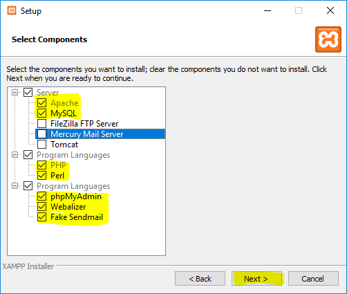

# Configuración de un entorno Web de desarrollo
## Introducción
Este documento es una guía práctica para crearnos un entorno Web......
## Índice
1. Instalación Xampp
1. Configuración Virtual Host de Apache
1. Instalación de Eclipse
1. Definición de WorkSpace
1. Definición de proyecto
1. Definición de repositorio local
1. Creación de un Repositorio de GitHub
1. Exportación de la rama "master" local sobre el repositorio GitHub

## 1. Instalación de Xampp

XAMPP es un servidor independiente de plataforma de código libre. Nos permite instalar de forma sencilla Apache en nuestro propio ordenador, obteniendo de este modo un servidor Web.
XAMPP incluye además servidores de bases de datos como MySQL con su gestor phpMyAdmin e incorpora también el intérprete de PHP, el intérprete de Perl, entre muchas cosas más.
XAMPP es una herramienta de desarrollo que te permite probar tu trabajo (páginas web o programación por ejemplo) en tu propio ordenador sin necesidad de tener que acceder a internet.

### Proceso de instalación
Antes de instalar el paquete Xampp, deberemos comprobar que no existe ningún servidor Web instalado previamente en nuestro ordenador( esto lo podemos hacer escribiendo http://localhost en nuestro navegador y viendo si nos da un mensaje de error).

A continuación nos dirigimos al siguiente enlace https://www.apachefriends.org/es/index.html desde donde podremos descargar la aplicación de manera gratuita. Escogeremos la última versión (que a día de 12/07/2019 es la 7.3.7(PHP 7.3.7)) correspondiente al sistema operativo de nuestro ordenador y clicaremos en el botón de descargar.
Una vez tengamos el archivo descargado, haremos un doble clic en él y nos aparecerá un aviso de permisos restringidos. Pulsamos Ok y empezamos con la instalación. Vamos siguiendo las instrucciones *next* y en la pantalla de *Select components* escogeremos los siguientes:



Ahora nos muestra la carpeta en la que se va a instalar Xampp, que por defecto será C:\xampp, le decimos *next*, aquí y en las pantallas siguientes hasta que sale *Ready to install* y entonces empezará la instalación. Parará un momento para preguntarnos si queremos iniciar el panel de control y marcaremos el checkbox, *next*, escogemos el idioma (inglés o alemán) y *save*.
Se nos abre el panel de control y tenemos que clicar los *start* de *Apache* y *MySQL*, siendo ésta la imagen final:


Instalación finalizada!!

## 2. Configuración Virtual Host de Apache

Configurar un Host Virtual es la mejor solución para obtener proyectos 100% independientes y mantener la raíz del sitio Web autónoma y poder, de esta manera, crear rutas absolutas de archivos y carpetas.
Para crear un Host Virtual tendremos que seguir los siguientes pasos:
### 2.1. Editamos el archivo httpd_vhosts.conf
que está ubicado en C:\xampp\apache\conf\extra\httpd_vhosts.conf
### 2.2. Le añadimos las siguientes líneas de código al archivo httpd_vhosts.conf:

```
<VirtualHost *:80>
	ServerAdmin webmaster@pla1.pqtm19.local
	DocumentRoot "C:/PQTM19/Projectes/pla1.pqtm19.local"
	ServerName pla1.pqtm19.local
	ErrorLog "logs/pla1.pqtm19.local-error.log"
	CustomLog "logs/pla1.pqtm19.local-access.log" common
	<Directory "C:/PQTM19/Projectes/pla1.pqtm19.local">
		DirectoryIndex index.php index.html index.htm
		Options Indexes FollowSymLinks Includes ExecCGI
		AllowOverride All 
		Order allow,deny
		Allow from all
		Require all granted
	</Directory>
</VirtualHost>
```
### 2.3. Abrir el editor Notepad++ en modo administrador y editar el archivo hosts
que está ubicado en C:\Windows\System32\drivers\etc\hosts
y le añadimos al final:
```
127.0.0.1 pla1.pqtm19.local
```
### 2.4. Creamos el directorio:
C:\PQTM19\Projectes\pla1.pqtm19.local

### 2.5. Reiniciamos Apache
### 2.6. Comprobamos que funciona en el navegador


## 3. Instalación de Eclipse

Eclipse es un entorno integrado de desarrollo de código abierto programado principalmente en Java (por tanto es multiplataforma) para desarrollar proyectos en C, C++, COBOL, Perl, PHP y muchos otros.  
Antes de instalar Eclipse debemos tener previamente instalado Java Runtime Environment en nuestro ordenador (en versiones de 32 o 64 bits dependiendo de lo que requiera nuestro Windows)  
Página de descarga de Java Runtime Environment 10 (64 bits)  
http://www.oracle.com/technetwork/java/javase/downloads/jre10-downloads-4417026.html  
Página de descarga de Java Runtime Environment 8 (32 bits)  
https://java.com/es/download/manual.jsp

Ahora ya estamos preparados para instalar Eclipse. Nos vamos a la pág web:

http://www.eclipse.org/downloads/   y hacemos clic en downloads 64 bits. Una vez descargado el archivo, haremos doble clic en él, entonces nos dará a escoger entre muchas opciones y dependiendo de lo que vayamos a desarrollar elegiremos una u otra. En nuestro caso clicaremos en esta:


A continuación le indicaremos en qué carpeta queremos instalarlo y clicaremos en *install*, aceptamos licencias y comienza la instalación. Cuando lleguemos a la página de *Certificates* tendremos que marcar los dos checkbox que hay y aceptar selección.
Cuando llegamos a esta página la instalación está finalizada y solo debemos clicar en *launch*


## 4. Definición de WorkSpace

En Eclipse, los archivos se agrupan en proyectos y estos, a su vez, se agrupan en espacios de trabajo o *workspaces*.
Se pueden tener definidos diversos *workspaces* pero sólo se puede tener abierto uno, para cambiar de espacio de trabajo hay que cerrar y abrir de nuevo Eclipse o bien utilizar el comando File->Switch Workspace...  
Físicamente, cada *workspace* se guarda en el disco duro del ordenador en una carpeta diferente. En ella, Eclipse guarda los archivos de configuración de Eclipse y la información de los proyectos, carpetas y archivos incluidos en cada proyecto.

Cada vez que abrimos Eclipse, nos preguntará en qué *workspace* queremos trabajar, mostrándonos como predeterminado el último que hemos utilizado, por este motivo, es importante no marcar el checkbox *"Use this as the default ..."*, para poder escoger en qué *workspace* queremos trabajar.


## 5. Definición de proyecto

Como he dicho anteriormente Eclipse organiza los ficheros en proyectos y nos los muestra en la ventana *Project Explorer* (a la izquierda de la pantalla) que en realidad, es nuestro *workspace*.  
Para crear un proyecto, vamos al comando File->New->Project:

aquí va la foto de newproject --------------------------------------------------------------------------

Nosotros vamos a crear un proyecto llamado:  
pla1.pqtm19.local que estará dentro del *workspace*: C:\PQTM19\Projectes

foto pla10 ----------------------------------------------------------------------------------------------

Clicamos en *next* y después *finish* y ya nos aparecerá en la ventana *Project Explorer*.  
En el explorador de Windows podemos comprobar cómo nos ha creado la carpeta dentro del directorio que le hemos indicado.

## 6. Definición de repositorio local

En general, trabajaremos con un repositorio local, que es el que tenemos en nuestro ordenador, y un repositorio remoto, que puede estar en GitHub, GitLab, o donde sea (nosotros utilizaremos GitHub).  
Para crear nuestro repositorio local, nos situaremos encima de nuestro proyecto en *Project Explorer* y con el menú contextual iremos a  
New-> Other-> Git-> Git Repository *Next* y ahora nos sale una pantalla para que a través de *Browse* podamos escoger dónde colocar el repositorio:

foto repositoriolocal--------------------------------------------------------------------------

Ahora podremos observar que en el *Project Explorer* nos sale el nombre del proyecto con el icono de repositorio.

## 7. Creación de un Repositorio de GitHub

Una vez nos hayamos creado una cuenta en GitHub (debemos acordarnos de confirmar nuestra dirección de correo desde el mail que envía GitHub), podemos acceder desde nuestro xxxxxx a *Mis repositorios*
## 8. Exportación de la rama "master" local sobre el repositorio GitHub


